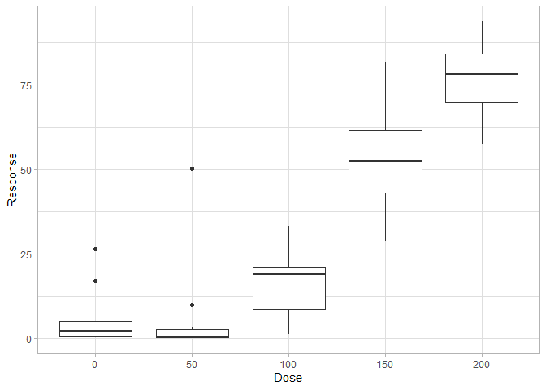

ANOVA and NOAEL in toxicology
================
Andreas Sagen
08/03/22

No observable adverse-effect level (NOAEL) in the field of toxicology is
a level of exposure of an organism, found by experimental or
observation, at which there is no biologically or statistically
significant increase in the frequency or severity of any adverse effects
of the tested protocol. This measurement was (and to some degree still
is) commonly used to assess safe levels of compounds to biological life,
particularily to humans. In drug development it is often use data from
laboratory animals, prior to human trials to establish a safe clinical
starting dose in humans. Other levels are also commonly used like lowest
observable adverse-effect level (LOAEL), which is the lowest level where
it is possible to observe biologically or statistically significant
effects in the test organism.

## Loading R packages

For this guide, two packages are needed. `tidyverse` to import the data
and visual representation, while `DescTool` provide dunnett test to
obtain the solution to the problem.

``` r
library(tidyverse)
library(DescTools)
```

## Loading the data

The data is loaded using *read_csv* from `readr`. The response variable
is imported as type double, while dose variable is imported as
factorial.

``` r
df <- readr::read_csv(
    "data/dose-response.csv",
    col_types = cols(
        Dose = col_factor(),
        Response = col_double()
    )
)
```

## Visualize data

A *boxplot* created using `ggplot2` visualizing the imported data.

``` r
df %>% ggplot(aes(x = Dose, y = Response)) +
    geom_boxplot() +
    theme_light()
```

<!-- -->

## Analysis of variance

A one-way analysis of variance (ANOVA) is used to determine if there is
any difference between the groups in the dataset. The ANOVA test assumes
that:

-   Independence: All observations should be independent from each
    other.
-   Homogeneity of variance: Equal variance distribution in the
    populations.
-   Normality: Dependent variable has to be normally distributed in each
    group.

``` r
aov <- stats::aov(Response ~ Dose, data = df)
base::summary(aov)
```

    ##             Df Sum Sq Mean Sq F value              Pr(>F)    
    ## Dose         4  40161   10040    62.7 <0.0000000000000002 ***
    ## Residuals   45   7206     160                                
    ## ---
    ## Signif. codes:  0 '***' 0.001 '**' 0.01 '*' 0.05 '.' 0.1 ' ' 1

The ANOVA analysis tells us that there is a difference between the
groups, i.e. more difference between the groups than within. This
doesn’t tells us which groups are different from the control dose. To
find this another analysis tool has to be used.

## Dunnett’s test

A dunnett test is performed to find NOAEL and LOAEL.

``` r
DunnettTest(
    Response ~ Dose,
    data = df,
    control = "0",
    conf.level = 0.9
)
```

    ## 
    ##   Dunnett's test for comparing several treatments with a control :  
    ##     90% family-wise confidence level
    ## 
    ## $`0`
    ##             diff     lwr.ci   upr.ci                 pval    
    ## 50-0   0.6516934 -11.929152 13.23254               0.9999    
    ## 100-0 10.8463820  -1.734463 23.42723               0.1852    
    ## 150-0 46.9877229  34.406878 59.56857         0.0000000011 ***
    ## 200-0 71.0274840  58.446639 83.60833 < 0.0000000000000002 ***
    ## 
    ## ---
    ## Signif. codes:  0 '***' 0.001 '**' 0.01 '*' 0.05 '.' 0.1 ' ' 1

Using the p-values to determine which groups are different from the
control at *p* \< 0.05, thus we can see that the `NOAEL` value must be
dose 100, while `LOAEC` is dose 150.
